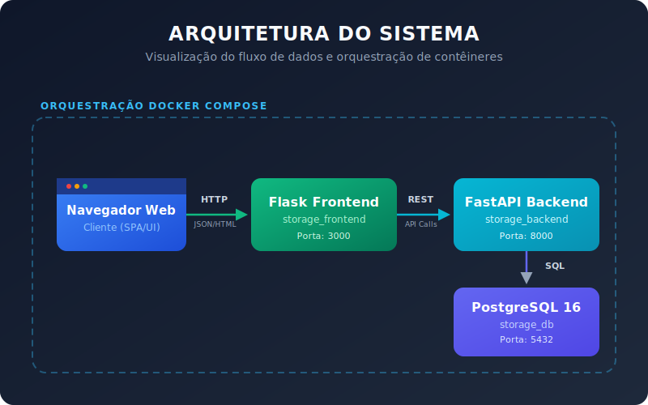

# 📦 Storage Management — Sistema de Controle de Estoque

<p align="center">
	
	
	
	
	
	
	
	
</p>


Este é um sistema de controle de estoque conteinerizado multi-serviço desenvolvido com **FastAPI** (backend), **Flask** (frontend) e **PostgreSQL** (banco de dados). Os serviços são orquestrados utilizando **Docker Compose**.

<p align="center">
  
</p>

---

## 🚀 Como Executar o Projeto (Docker)

### 1. Pré-requisitos
Certifique-se de ter instalado em sua máquina:
* [Docker Desktop](https://www.docker.com/products/docker-desktop/)
* [Docker Compose](https://docs.docker.com/compose/install/)

### 2. Configurar Variáveis de Ambiente
Copie o arquivo de exemplo de variáveis de ambiente para criar sua própria configuração:
```bash
cp .env.example .env
```
Abra o arquivo `.env` e certifique-se de que as configurações do banco de dados atendem às suas necessidades (os valores padrão estão pré-configurados para funcionar imediatamente com o Docker).

### 3. Iniciar os Contêineres
Construa e inicie todos os serviços em segundo plano:
```bash
docker-compose up -d --build
```
Isso iniciará três contêineres:
* **`storage_db`**: Banco de dados PostgreSQL 16.
* **`storage_backend`**: API REST FastAPI escutando na porta `8000`.
* **`storage_frontend`**: Interface web Flask escutando na porta `3000`.

### 4. Verificar o Status dos Serviços
Para garantir que tudo está rodando corretamente:
```bash
docker-compose ps
```

---

## 🖥 Acessando a Aplicação

Assim que os contêineres estiverem rodando, você poderá acessar as seguintes interfaces:

* **Dashboard do Frontend:** [http://localhost:3000](http://localhost:3000)
  * Visualize níveis de estoque, alertas de estoque baixo e últimas movimentações.
  * Gerencie detalhes de estoque e realize entradas/saídas de produtos.
* **Documentação da API Backend (Swagger UI):** [http://localhost:8000/docs](http://localhost:8000/docs)
  * Explore e teste os endpoints da API de forma interativa.
* **Documentação da API Backend (ReDoc):** [http://localhost:8000/redoc](http://localhost:8000/redoc)

---

## 🧪 Executando Testes (No Docker)

Você pode executar a suíte de testes unitários e de integração do backend dentro do contêiner do backend que está rodando:
```bash
docker-compose exec backend pytest -v
```

---

## 🛑 Parando a Aplicação

Para desligar todos os contêineres e redes:
```bash
docker-compose down
```
Para parar os serviços e também remover o volume persistente do banco de dados (atenção: isso apagará todos os dados):
```bash
docker-compose down -v
```
